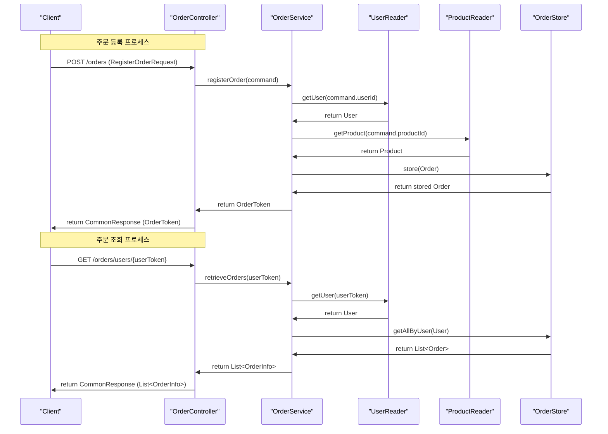
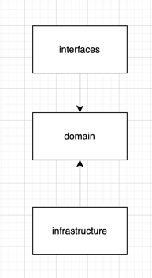
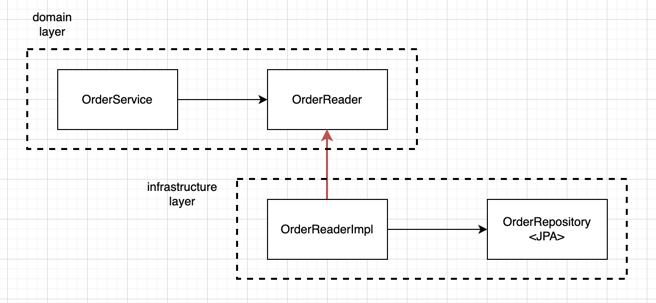

# 1. 개요
- Clean Code와 DDD를 참고하여 간단한 예제를 작성

# 2. Sequence Diagram

# 3. 패키지 구조 설명

- 각 레이어안에서의 참조는 허용
- application layer가 필요할 수 있다.
  - applicaton layer는 트랜잭션이 필요한 서비스 + 트랜잭션이 필요하지 않은 서비스의 묶음으로 정의한다.
## interfaces
- controller
- request
- mapper
## domain
- entity
- service
- command, criteria
- info
- reader, store 
## infrastructure
- JPA 구현체
- 구현 예시
